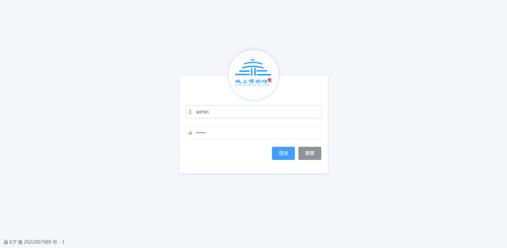
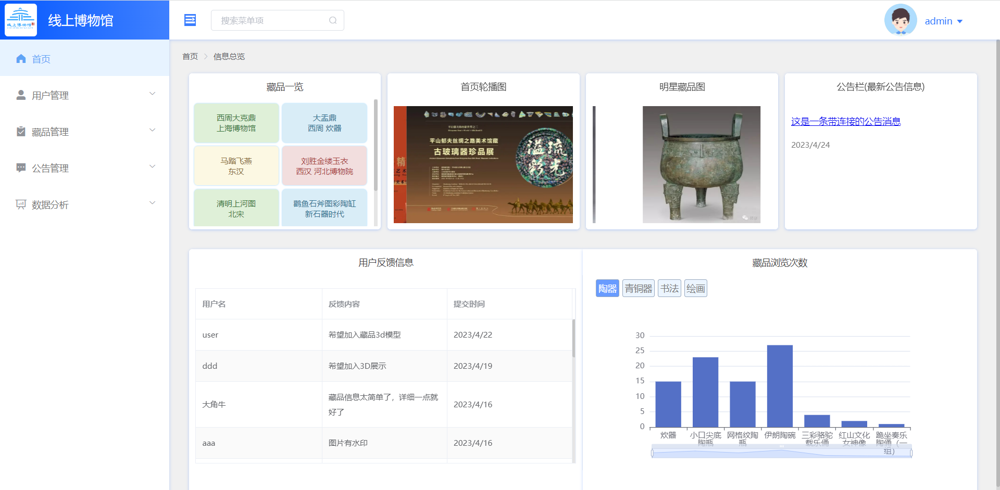
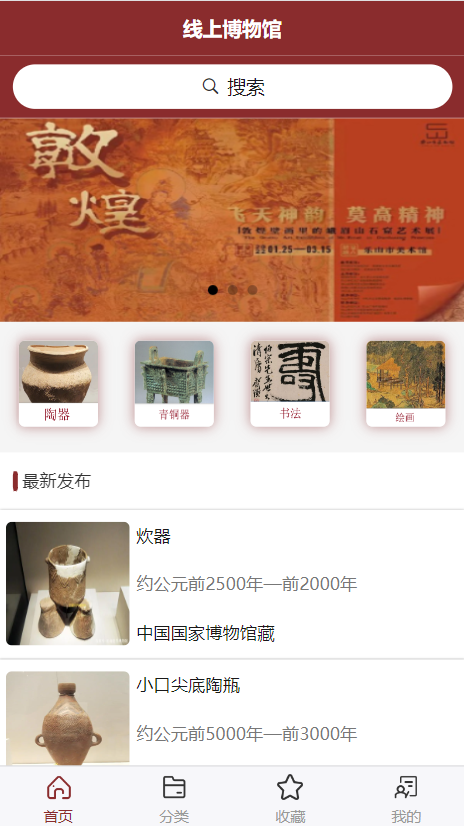
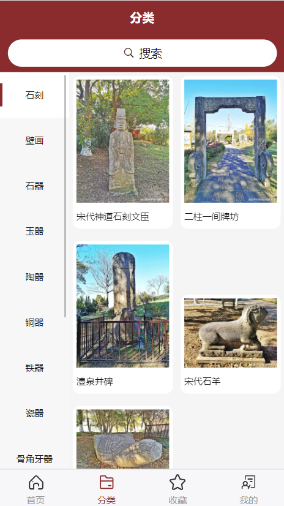
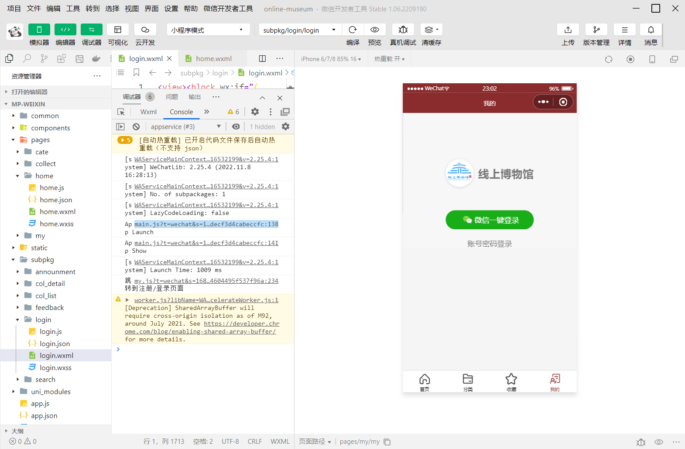

# 项目安装和使用说明

## 1 运行环境配置

### 1.1 下载nodeJs

- 下载地址： [Node.js](https://nodejs.org/en/)

- 检查是否安装成功：winds+ r打开cmd，输入命令node -v，出现版本号就是成功了

  ```
  node -v
  v16.15.0
  ```

### 1.2 安装npm

- [网上教程](https://blog.csdn.net/thingir/article/details/118003851?ops_request_misc=%257B%2522request%255Fid%2522%253A%2522168381312716800184125519%2522%252C%2522scm%2522%253A%252220140713.130102334..%2522%257D&request_id=168381312716800184125519&biz_id=0&utm_medium=distribute.pc_search_result.none-task-blog-2~all~top_positive~default-1-118003851-null-null.142^v87^insert_down28v1,239^v2^insert_chatgpt&utm_term=%E5%AE%89%E8%A3%85npm&spm=1018.2226.3001.4187)

- 检查是否安装成功：winds+ r打开cmd，输入命令npm -v，出现版本号就是成功了

  ```
  npm -v
  8.5.5
  ```

  - 注：以上nodeJS和npm版本皆为本项目所使用版本

## 2 导入数据库文件

- 将项目文件下载到本地

- 将项目根目录下的 museum_db.sql 文件导入本地数据库

## 3 开启本地服务器

### 3.1 修改配置信息

- 打开online-museum\api_server\db目录下的index.js文件，修改数据库名和密码

  ```
  const mysql = require('mysql')
  const db = mysql.createPool({
    host: '127.0.0.1',
    user: 'root',  			// 将root修改为你的本地数据库用户名
    password: 'admin123',		// 将admin123修改为你的密码
    database: 'museum_db'
  })
  module.exports = db
  ```

### 3.2 运行本地服务器

- 在api_server目录下shift+鼠标右键打开powershell窗口，运行 npm i 命令

- 接着运行 node app.js 命令，打印api server runing at http://127.0.0.1:8090，则已打开本地服务器

  ```
  npm i
  node app.js
  api server runing at http://127.0.0.1:8090
  ```

## 4 运行后台管理系统

- 在museum_backstage目录下shift+鼠标右键打开powershell窗口，运行 npm i 命令

- 接着运行 npm run serve 命令，看到 app running at：- Local:   http://localhost:8080，则程序运行成功

  ```
  npm i
  npm run serve
   App running at:
    - Local:   http://localhost:8080
    - Network: http://192.168.0.109:8080
  ```

- 成功界面展示

  

## 5 运行前台小程序

### 5.1 下载HbuilderX

### 5.2 在HbuilderX里导入online-museum

### 5.3 安装项目依赖

- 在online-museum目录下shift+鼠标右键打开powershell窗口，运行 npm i 命令

### 5.3 前台项目运行在浏览器

#### 5.3.1 运行配置

- 在HbuilderX界面依次点击 运行->运行到浏览器->配置web服务器，找到 浏览器运行配置，导入你的浏览器安装路径

- 再次点击 运行->运行到浏览器->Chrome（这里点击刚刚你导入安装路径的浏览器）

- 成功界面展示

  

​														   		 

### 5.4 前台项目运行到微信小程序

#### 5.4.1 安装微信小程序开发者工具

- 下载并安装微信开发者工具
- 微信开发者工具设置：打开微信开发者工具，顶部菜单设置 > 安全设置，打开服务端口

#### 5.4.2 运行配置

- 在HbuilderX界面依次点击 运行->运行到浏览器->配置web服务器，找到 小程序运行配置，导入你的微信开发者工具安装路径

- 项目中找到manifest.json文件进行如下配置AppID，依次点击manifest.json->微信小程序配置，找到微信小程序AppID，将里面的AppID改为你自己的AppID（重点）

- 再次点击 运行->运行到小程序模拟器->运行微信开发者工具(W)-[online-museum]

- 成功界面展示

  


